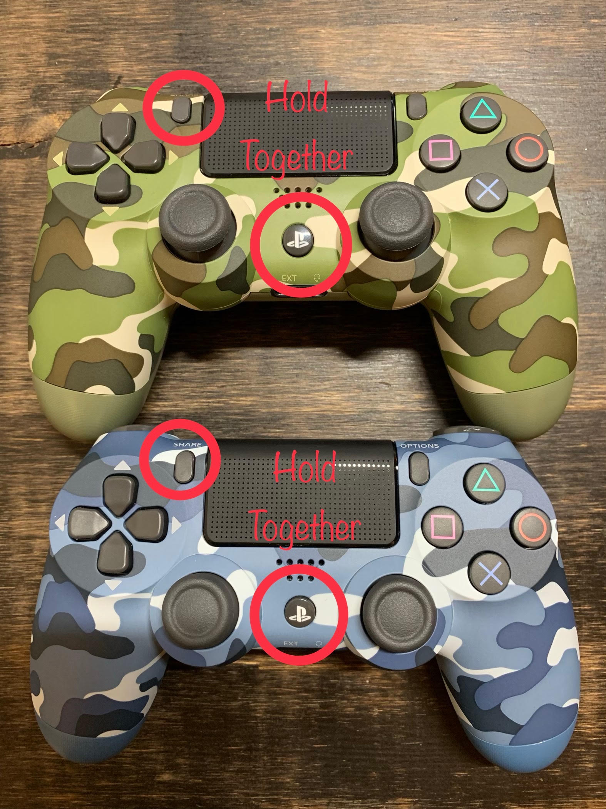
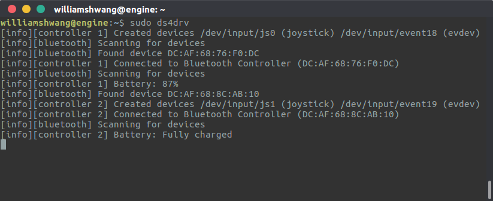
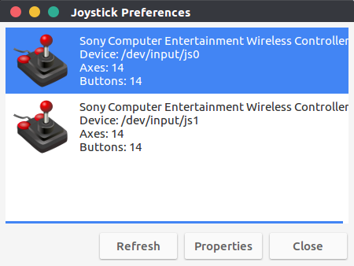
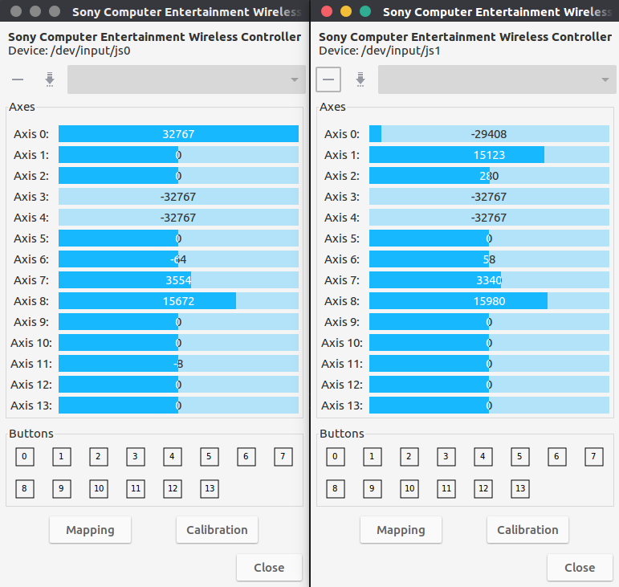

I bought two [Sony PlayStation DualShock 4 joysticks][DS4_Joystick] (DS4) recently. I'm planning to connect my Linux computer and use them in ROS. The current [joystick_drivers][ros_joystick_drivers] in ROS does not support DS4.

To connect DS4 to Linux, I need to installl [ds4drv](ds4drv) to connect to the DS4 joysticks.

Following are the steps to connect joysticks:

**1. Install & Run *ds4drv***:

```bash
sudo pip install ds4drv
sudo ds4drv
```

---

**2. Connect DS4 joystick**

Hold **SHARE** and **PS** button untill joystick indicator flashes. **ds4drv** will automatically search for device and establish connection.
(If there is more than one joystick need to connect, just repeat the connection process for the first joystick.)

<!-- <p align="center"></p> -->

You can see print out like:

<!-- <p align="center"></p> -->

Joysticks has been assigned to **/dev/input/js0** and **/dev/input/js1**.

---

**3. Check Connection In ROS**

In a new terminal,
```bash
roscore
```

In a new terminal, use roslaunch to start nodes for two joy sticks,
```bash
roslaunch ros_launch_file.launch
```

Launch file to launch two **joy_node**,
```XML
<?xml version="1.0"?>
<launch>

    <group ns="j0">
        <node name="ds4_joystick" pkg="joy" type="joy_node">
                <param name="dev" value="/dev/input/js0" />
        </node>
    </group>

    <group ns="j1">
        <node name="ds4_joystick" pkg="joy" type="joy_node">
                <param name="dev" value="/dev/input/js1" />
        </node>
    </group>

</launch>
```

---

**4. Check joysticks' output**

**Use ROS**
In two new terminals,
```bash
rostopic echo /j0/joy
rostopic echo /j1/joy
```

and see print out changes as you press the buttons.

**Or**

**Use jstest**
```bash
sudo apt-get install jstest-gtk
jstest-gtk
```


<!-- <p align="center"></p> -->


<!-- <p align="center"></p> -->


[DS4_Joystick]: https://en.wikipedia.org/wiki/DualShock#DualShock_4
[ros_joystick_drivers]: http://wiki.ros.org/joystick_drivers
[ds4drv]: https://github.com/chrippa/ds4drv