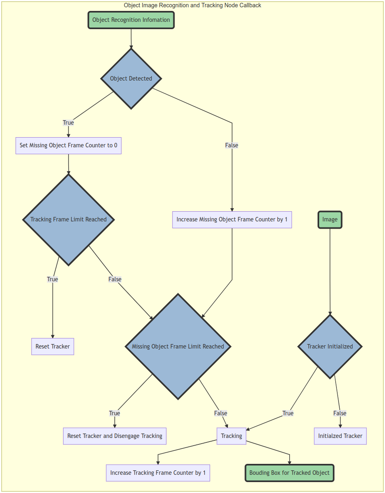

## About
This is my MSR capstone project with [Prof. Argall][Argall]'s at research lab at [Shirley Ryan AbilityLab][SRALAB]. The goal of this project is to build a ROS package that uses visual servoing technique and RGBD sensor to guide robotic arm to a pre-grasp pose for grasping household objects without prior knowledge of the objects (E.g. shape, size, color of the object). The ROS package is designed to be generic and modular so it can be easily adapted to different types of robotic arms.

---

## Challenges
The challenges in this project mostly come from two aspects, **visual servoing**, and **point cloud processing**.

#### Visual Servoing
Visual servoing control uses a vision feedback loop to enable reactive control, which makes visual servoing ideal for tracking. There are two basic types of visual servoing, image based visual servoing, and position based visual servoing; there control laws were derived in image space and Cartesian space respectively. If you want to know more about visual servoing, [Visual servo control, Part I: Basic approaches][VS Tutorial I] by *François Chaumette, S. Hutchinson* is introductory literature.

An important prerequisite of visual servoing is the known geometry of objects or known size of features. However, the geometry of objects and the size of the features are not provided in this project. This limitation rules out the use of image based visual servoing, and position based visual servoing is only possible with the vision feedback from RGBD sensor. However, position based visual servoing's tendency to lose objects in the sensor frame is not ideal for real-world application. A more predictable and reliable version of position based visual servoing will be needed. 

#### Point Cloud Processing 
A point cloud of a scene can be obtained easily with an RGBD sensor. RGBD sensors are great for midrange and large-scale application but a portable size RGBD sensor will have a hard time to obtain detailed point clouds of household objects. In addition to the limited detailed feature in the point cloud, RGBD sensors will perform poorly on highly reflective surfaces. So the quality of the point cloud return from a portable size RGBD sensor (Intel Realsense D435 in our case) is greatly depended on the size of the object and the material of the object.

Despite the quality of the point cloud, the pose of the point cloud can be difficult to estimate because of the occlusion of the object. Parts of the Objects are covered by people's hands when the robot is doing visual servoing on the object. This kind of occlusion may reduce the accuracy of object point cloud pose estimation. To solve this problem, a very accurate point cloud segmentation may be needed, and a step further, an online object point cloud registration process will be ideal.

In addition to occlusion, poses of highly symmetric objects are difficult to estimate if a certain orientation is required.

---

## Implementation

Please see [Github][mfvs] for ROS implementation.

This a flowchart of the implemetation pipline,

<!--  -->

#### Visual Servoing
In this project, we used Kinova Mico as our experimental platform and the package developed by the Argall Lab. The robot can subscribe to an end-effector velocity control input and calculate the corresponding joint velocity that drives the end-effector to closely matches the commanded end-effector velocity.

Here I used ViSP which was developed specifically for visual servoing. In the package, the visual seroving subscribes to a target pose and publishes an end-effector velocity. The target get pose is the 6 DOF pre-grasp pose (${x}$, ${y}$, ${z}$, ${roll}$, ${pitch}$, ${yaw}$) and the end-effector velocity is a 6DOF twist ($\dot{x}$, $\dot{y}$, $\dot{z}$, $\dot{roll}$, $\dot{pitch}$, $\dot{yaw}$).

#### Point Cloud Processing

The point cloud processing includes four essenstial parts,

1. Object Recognition and Tracking
2. Point Cloud Extraction
3. Point cloud segmentation and template generation
4. Point Cloud Pose Estimation

**1. Object Recognition and Tracking**

This part handles the task of finding the object of interest, keep track of this object in the RGB image. A robust tracking was achieved by combining information from object recognition and object tracking. The conjunction of object recognition and object tracking enhanced the tracking robustness and reliability; it outperforms approaches only use object recognition or object tracking.

Object recognition algorithms like YOLO was implemented to recognize the object of interest in the image and continue to do it on every frame. However, object recognition will often fail to detect the object in some frames due to poor pre-trained model. I added a non-deep-learning type image tracker to locate the object when recognition fails. The RGB tracker will be reinitialized whenever the object can be detected. The reinitialization of the image tracker also alleviates the drifting of the image tracker. The amalgamation of object recognition and tracking enables robust and accurate tracking. With a Kalman filter implemented to predict object position in between frames, consistent object location information can be sent to point cloud extraction node to extract points are closely bounded by the tracking bounding box.

To better explain this process here is a flowchart representation of the process,

**2. Point Cloud Extraction**

The point cloud extraction node can use this information to remove unwanted point cloud, which reduces unnecessary computation. The point cloud retrieved from RGBD sensor is structured which mean each point in the point cloud corresponds to one pixel in the RGB image, and they can be accessed by using row and column positions. With the location and size of the bounding box, point clouds enclosed in the bounding box region can be extracted easily. Therefore I can have a point cloud of the object with only a few unwanted points which can be eliminated by simple segmentation.

**3. Point Cloud Segmentation and Template Generation**

This part of the point cloud processing can take the closely bounded point cloud and apply segmentation techniques to eliminate point clouds that are not part of the object and create a clean object point cloud template for pose estimation.

**4. Point Cloud Pose Estimation**

In pose estimation, particle filter or ICP can be used with a template provided from the last part. The algorithms use the template to match the extracted point cloud and calculate a rigid transform. And pre-grasp pose can be set relative to the matched template. It is not necessary to create a template before the pose estimation when accurate point cloud segmentation and online object point cloud registration are available.

---

## Future Work
1. Choose a better sensor for small objects
2. Add filter to process raw point cloud input
3. Design and automate calibration process
4. Train better object recognition DL model for faster and more robust detection on household objects
5. Use better tracking algorithm to work with object recognition
6. Refine object recognition and tracking node to increase tracking frequency
7. Develop fast and robust segmentation algorithm for point cloud
8. Online point cloud registration to build object model

[mfvs]: https://github.com/willshw/mfvs
[Argall]: http://users.eecs.northwestern.edu/~argall/
[SRALAB]: https://www.sralab.org/
[VS Tutorial I]: https://hal.inria.fr/inria-00350283/document