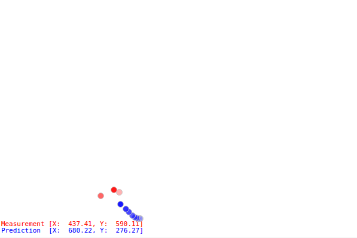

## About
I used **Python 2.7**, **[NumPy][NumPy]** and **[PyQtGraph][PyQtGraph]** to build a **GUI** application for visualizing estimation filters. A user can edit filter's parameters in the GUI and see the instance performance update of the filter. The application takes noise injected mouse pointer position as input and uses the assigned estimation filter to estimates the states of the pointer.

In the GIF above, the **red dots** are the noisy mouse pointer position measurements, and the **blue dots** are the filter predicted mouse pointer position. The darker color stands for more recent measurement or prediction.

As the mouse pointer glides around in the graph area, noise is added to the mouse pointer position to emulate the real world scenario where data streams are noisy. The estimation filter calculates the predicted mouse states iteratively with mouse pointer position updates.

New estimation filters can be added to the application easily in the future. So, the application can serve as a good to visualize a filter's performance.

Kalman filter is the default estimation filter implemented.

## Implementation
Please see **[GitHub repo][GitHub]** for more detail.

[GitHub]: https://github.com/willshw/filter-viz
[NumPy]: http://www.numpy.org/
[PyQtGraph]: (http://www.pyqtgraph.org/