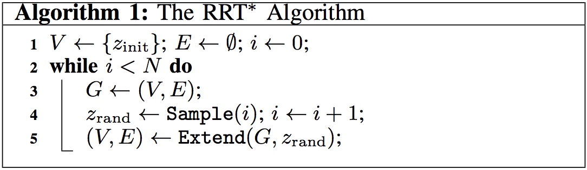
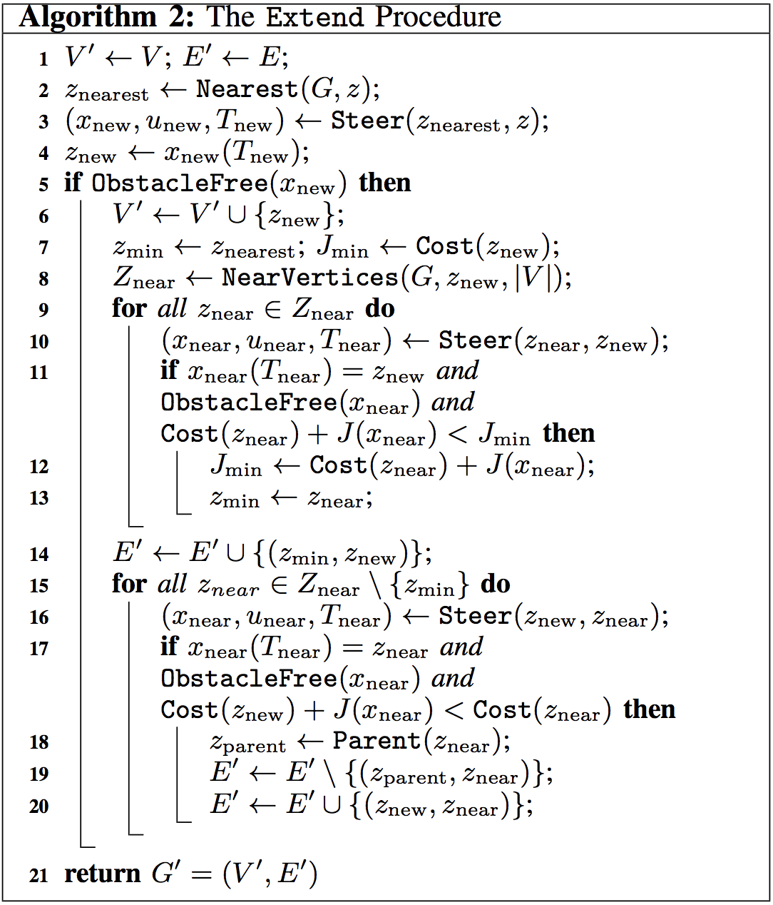
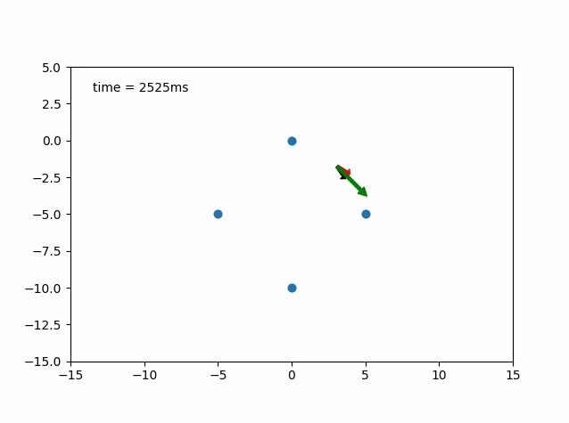
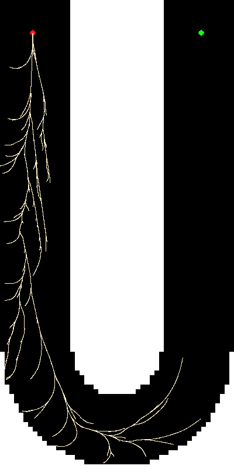
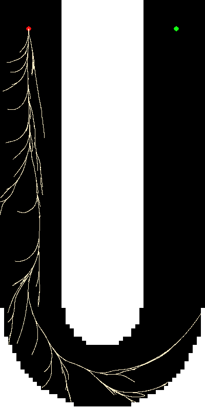

### About

**Kinodynamic Motion Planning** was my projects in winter quarter. The goal of this project was to learn and explore motion planning, and implement a motion planning algorithms in a program. The program used sampling-based method to generate a motion plan for a dynamic vehicle. 

In this project, I aimed at reproducing the result from a research paper, [Anytime computation of time-optimal off-road vehicle maneuvers using the RRT*][OFFROAD_RRT_STAR] from MIT. Authors of the paper proposed a solution to generate a kinodynamic motion plan for an off-road vehicle to drive through tight corners at high speed to achieve time-optimality. In the paper, authors employed a full dynamic model of a car which had taken the tire-road contact into account. With the full dynamic model, RRT-Star could find a plan that satisfied the vehicle dynamics. At extreme cases, motion plan for the vehicle is to slide from a state to another state.

### Vehicle Dynamics Model

Vehicle dynamics model employed in this project was a bicycle model, and Pacejka's Magic Formula was used for tire dynamics. The vehicle model had 8 states ($x$, $\dot{x}$, $y$, $\dot{y}$, $\Psi$, $\dot{\Psi}$, $\omega_F$, $\omega_R$), and 3 input value ($T_F$, $T_R$, $\delta$)

Here is an illustration of the bicycle model:

<!--  -->

**Notations:**

- $x$, $y$, $\dot{x}$, $\dot{y}$, $\ddot{x}$, $\ddot{y}$: Position, velocity, acceleration at the center of the vehicle
- $m$: Mass of vehicle
- $I_z$: Inertia of vehicle
- $I_i$, $r_i$, $\omega_i$, $i =(F, R)$: Moment of inertia, radius, angular velocity of front and rear wheels
- $f_{ij}$, $i=(F, R), j=(x, y)$: Longitudinal and lateral front and rear tire forces:
- $\Psi$: Vehicle orientation/ yaw angle
- $\beta$: Slip angle
- $T_i$, $i=(F, R)$: Torque input at front and rear wheels
- $\delta$: Steering angle input

**Equation of motion:**

- $m\ddot{x} = f_{Fx}cos(\Psi + \delta) - f_{Fy}sin(\Psi + \delta) + f_{Rx}cos(\Psi) - f_{Ry}sin(\Psi)$
- $m\ddot{y} = f_{Fx}sin(\Psi + \delta) + f_{Fy}cos(\Psi + \delta) + f_{Rx}sin(\Psi) + f_{Ry}cos(\Psi)$
- $I_z\ddot{\Psi} = (f_{Fy}cos(\delta) + f_{Fx}sin(\delta))l_F - f_{Ry}l_R$
- $I_F\dot{\omega}_ F = T_F - f_{Fx}r_F$
- $I_R\dot{\omega}_ R = T_R - f_{Rx}r_R$

Tire force $f_{ij}$ depends on normal force $f_z$ and friction coefficient $\mu_{ij}$ determined by **Pacejka's Magic Formula**:

- $f_{ij} = \mu_{ij}f_{iz} $  $(i = F,R, j=x,y)$
- $\mu_{ij} = -\frac{s_{ij}}{s_i}\mu_i(s_i) $  $(i = F,R, j=x,y)$
- $\mu_i(s_i) = D_i sin(C_i arctan(B_i s_i)) $   $(i = F,R)$

For more details about the vehicle dynamic model, please refer to [Anytime computation of time-optimal off-road vehicle maneuvers
using the RRT*][OFFROAD_RRT_STAR]

### RRT-Star

RRT-Star is a departure from the RRT. RRT-Star has modified the extend procedure which allows it to replan the nodes close to the newly inserted one. This procedure looks for the nodes that will have lower cost to reach from root after rewiring this node to the newly inserted one. This procedure garantees the sampling-based planner can find an solution and the solution is asymptotically optimal.

**RRT-Star Algorithm:**

<!--  -->
<!--  -->

**RRT-Star with 10K Node (Path Planning):**

### Planning Space

The full dynamic model of the car had 8 DOF ($x$, $\dot{x}$, $y$, $\dot{y}$, $\Psi$, $\dot{\Psi}$, $\omega_F$, $\omega_R$). Keeping track of 8 dimensional state space was rather complicated. To deal with this problem, planner only plans in a 4D task space in $x$, $y$, $V$($\sqrt{\dot{x}^2+\dot{y}^2}$), $\Psi$assuming the there was an mapping of the free space in 8 dimension state space to 4 dimension task space.

### Control

When solving for the control input needed for connecting current state and next state, I only solve for a constant control applied to the system. (Constant steering angle and constant acceleration) To solve for control, the vehicle dynamic equations were integrate to certain amount of time with initial conditions. Integration and optimization were all done using **scipy** functions. Since solving for an optimal control required integrating the stiff and non-linear ODE iteratively, it took some time to find the control that can take the vehicle from the current state to the new state.

Here are two GIFs of vehicle following predefined states.

- **Red Arrow**: Heading of the Vehicle
- **Black Arrow**: Steering Angle
- **Green Arrow**: Velocity of the Vehicle

<!--

 -->

### Current State

This project is expected to continue. This motion planning problem is rather complicated. The program was not efficient enough to find a complete motion plan in reasonable amount of time.

**Dfficulties Encountered:**

- The planner suffers from the performance issues of low efficiecy at searching for a set of constant control to connect two states
- The rate of sampling a valid and reachable state was low thus sampling time was too long.
- A valid cost to go function was also a key component to the solution missed.

The planner was not able to finish the whole planning task as shown in following figures:

|||

**Things to be worked on:**

- A fast numerical solver for the stiff problem must need to implemented to improve the state connection calculation time.
- Instead of looking for a fast ODE solver, utilizing a physics simulation engine to handle the state integration can be a great approach, since physics simulation engines are often fast at solving for complex physics model with some sacrifices on accuracy. (Focus on sovling motion planning instead of solving physics model)
- Employing some probabilistic sampling techniques can improve the chance of sampling valid states.
- In the future, the vehicle geometry also need to be taken into account for more realistic collision detection.

### Reference

1. [hwan Jeon, Jeong, Sertac Karaman, and Emilio Frazzoli. "Anytime computation of time-optimal off-road vehicle maneuvers using the RRT." Decision and Control and European Control Conference (CDC-ECC), 2011 50th IEEE Conference on. IEEE, 2011.][OFFROAD_RRT_STAR]
2. [Webb, Dustin J., and Jur van den Berg. "Kinodynamic RRT*: Asymptotically optimal motion planning for robots with linear dynamics." Robotics and Automation (ICRA), 2013 IEEE International Conference on. IEEE, 2013.][ROBOT_LINEAR_DYNAMICS]
3. [LaValle, Steven M., and James J. Kuffner Jr. "Randomized kinodynamic planning." The international journal of robotics research 20.5 (2001): 378-400.][RANDOMIZED_KINO_PLANNING]

[RANDOMIZED_KINO_PLANNING]: http://msl.cs.uiuc.edu/~lavalle/papers/LavKuf01b.pdf
[ROBOT_LINEAR_DYNAMICS]: http://arl.cs.utah.edu/pubs/ICRA2013-1.pdf
[OFFROAD_RRT_STAR]: https://dspace.mit.edu/openaccess-disseminate/1721.1/81445
