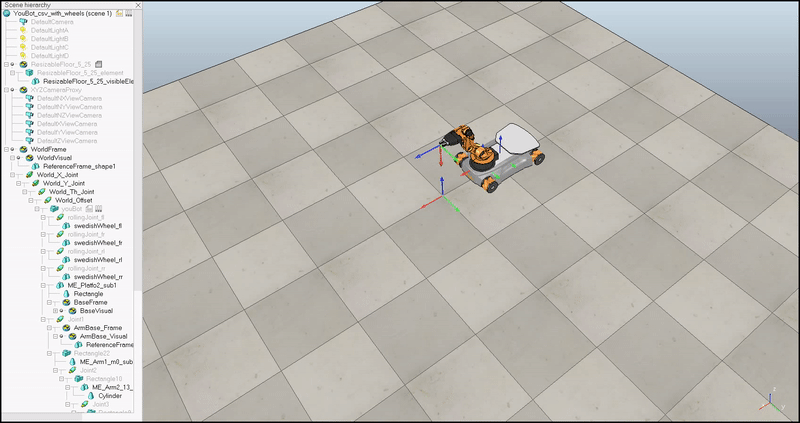
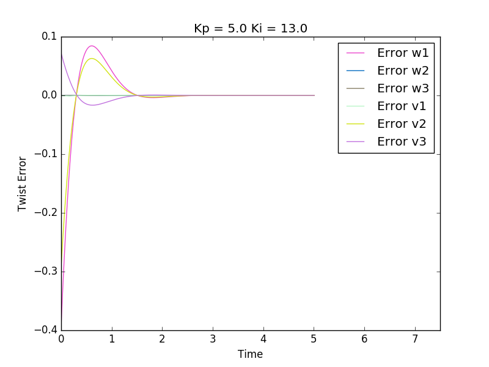
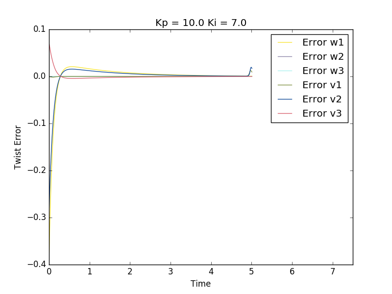

## About

This is a course project of [ME449 Robotic Manipulation][ME449] at Northwestern University. The course was developed and taught by [Prof. Lynch][Kevin]. Prof. Lynch taught this course using a textbook he wrote, [Modern Robotics][Modern Robotics], which includes a series of videos about the book material and an opensource software suite about robot manipulation. Project problem statement can be found in exercise 13.33(d) in [Modern Robotics][Modern Robotics].

In this project, I was given a target trajectory and I needed to develop a controller to control the end-effector of the Kuka youBot to follow the target trajectory. In order to achieve satisfactory target trajectory tracking, I used feedforward and PI controller to calculate the desired joint velocities.

## Implementation 
#### 1.Kinematics
The target trajectory was defined as a function of time with time-scaling. First, I derived the derivative of this trajectory function. With the function of the trajectory and the derivative of this function, I could calculate the desired twist at a given time of this trajectory. Since the trajectory was given in the end-effector frame. I used modern robotics library to transform the end-effector twist frame into body frame with the current robot configuration such as wheel angles and joint angles.

#### 2.Controller
After the body frame twist was acquired, I calculated the twist error and applied feedforward control and PI control to calculate the twist needed to apply to minimize the error. Corresponding joint angles were calculated using the actuation twist and jacobian of the current robot configuration.

##### Testing Feedforaward Control

##### PID Control and Feedforward Control

##### Performance Difference of Two PID Controllers

## Visualization
To visualize the movement of the youBot, I generated a CSV file with the joint configuration at each time step and used VREP to playback the trajectory generated by my codes.

[ME449]: http://hades.mech.northwestern.edu/index.php/ME_449_Robotic_Manipulation
[Modern Robotics]: http://hades.mech.northwestern.edu/index.php/Modern_Robotics_Videos
[Kevin]: https://www.mccormick.northwestern.edu/research-faculty/directory/profiles/lynch-kevin.html